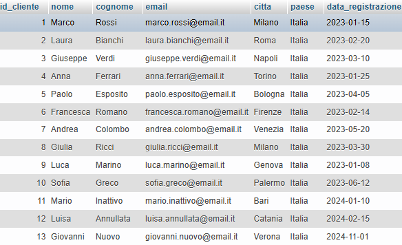
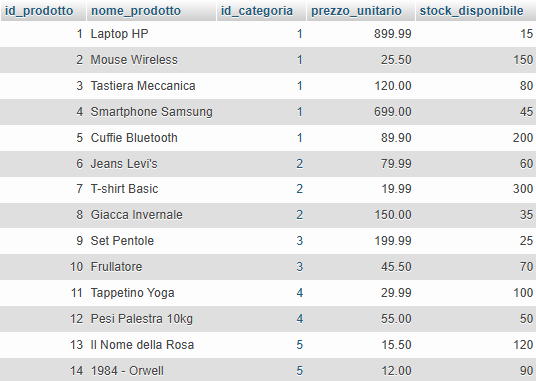
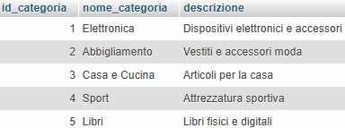
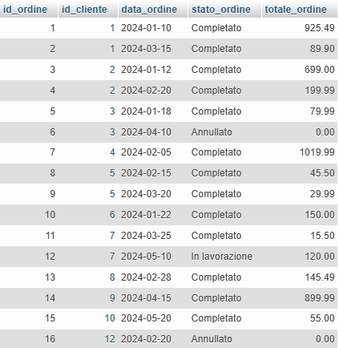
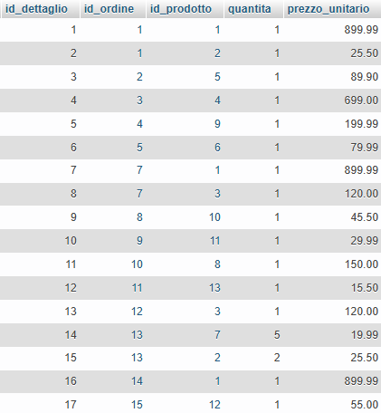
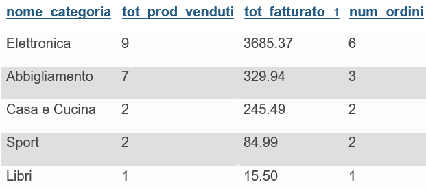

# Progetto SQL per portfolio: e-commerce analytics

## Descrizione
Progetto di analisi dati per un'azienda e-commerce fittizia. 
L'obiettivo è rispondere a domande business attraverso query SQL su un database relazionale con 5 tabelle contenenti informazioni su clienti, prodotti, ordini e vendite.

Analisi richieste:
- performance dei clienti per identificare i più redditizi
- quali sono i prodotti rimasti invenduti da rimuovere dal catalogo / promuovere
- quali sono le categorie di prodotto più performanti su cui investire
- chi sono i clienti inattivi da invogliare con campagne marketing
- trovare trend di vendita mensili per identificarne la stagionalità

## Struttura Database

Il database si chiama `ecommerce_analytics` e contiene 5 tabelle principali:

---

**Tabella clienti** contenente informazioni anagrafiche e data di registrazione dell'account:
  
  

**Tabella prodotti** contenente il catalogo prodotti con prezzi e id categoria d'appartenenza:
  
  
  
**Tabella categorie** contenente le categorie dei prodotti presenti in catalogo:
  
  
  
**Tabella ordini** contenente gli ordini effettuati dai clienti, con stato dell'ordine (completato, annullato, ecc) e prezzo totale:
  
  
  
**Tabella dettaglio ordini** contenente i dettagli aggiuntivi sui prodotti acquistati in ogni singolo ordine (quantità e prezzo):
  
  
  

## Tecnologie Utilizzate
**Database:** MySQL, **Tool:** MAMP, phpMyAdmin, **Linguaggio:** SQL

## File del Progetto
- `database_setup.sql` script di creazione database e inserimento dei dati
- `query_1_top_clienti.sql` query top 5 clienti
- `query_2_prodotti_invenduti.sql` query prodotti mai venduti
- `query_3_vendite_categoria.sql` query analisi categorie
- `query_4_clienti_inattivi.sql` query clienti senza ordini
- `query_5_performance_mensile.sql` query trend mensili
- `README.md` documentazione progetto
- immagini png caricate in questo documento

## Come Utilizzare
1. Importare `database_setup.sql` in MySQL/phpMyAdmin
2. Eseguire le query presenti nella cartella `queries/`
3. Analizzare i risultati

## Query Implementate

### 1. Top 5 clienti per fatturato
**Obiettivo:** identificare i clienti più redditizi 

Serviranno: anagrafica del cliente (nome, cognome, città), il totale che ha speso (somma di tutti gli ordini) e il numero di ordini da lui effettuati.
Consideriamo solo ordini effettivamente completati (escludendo "Annullato" e "In lavorazione").

Utilizzerò: INNER JOIN, aggregazioni (SUM, COUNT), WHERE, GROUP BY, ORDER BY con LIMIT a 5, filtri su stato ordine

**Risultato:** 5 migliori clienti con totale speso e numero ordini

---

### 2. Prodotti mai venduti
**Obiettivo:** identificare prodotti a catalogo che non generano vendite per considerare promozione o rimozione

Serviranno: nome del prodotto, la sua categoria d'appartenenza, il suo prezzo unitario e lo stock disponibile.
Dovremo trovare i prodotti dove id_dettaglio è NULL (cioè non presenti nella tabella dettagli_ordini)

Utilizzerò: LEFT JOIN, filtro con IS NULL, JOIN tra 3 tabelle, gestione di relazioni molti-a-molti

**Risultato:** un prodotto mai venduto ("1984 - Orwell", categoria Libri)

---

### 3. Analisi vendite per categoria
**Obiettivo:** identificare le categorie più redditizie per investimenti mirati

Serviranno: nome categoria, quantità tot di prodotti venduti, fatturato generale, numero di ordini distinti che hanno al loro interno prodotti di quella categoria.
Come per la query1, vanno considerati solo gli ordini effettivamente completati (escludendo "Annullato" e "In lavorazione").

Utilizzerò: JOIN concatenati, calcoli (quantità × prezzo unitario), aggregazioni multiple (SUM, COUNT DISTINCT), GROUP BY su categorie, filtri su ordini completati

**Risultato:** elettronica è la categoria più redditizia (3685€), seguita da Abbigliamento (330€)

---

### 4. Clienti inattivi
**Obiettivo:** trovare clienti che si sono registrati ma che non hanno completato ordini per invogliarli con promozioni mirate 

Serviranno: nome e cognome del cliente, email su cui inviare le promozioni, data di registrazione, giorni trascorsi dalla registrazione

Utilizzerò: subquery con NOT IN, calcoli con date (DATEDIFF), WHERE NOT IN per logica negativa (trovare assenze)

**Risultato:** 3 clienti inattivi identificati

---

### 5. Performance mensile 2024
**Obiettivo:** analizzare i trend stagionali e le performance mensili

Serviranno: nome del mese, numero di ordini completati e fatturato totale in tale mese, numero di clienti unici che hanno acquistato in quel periodo.

Utilizzerò: funzioni su date (YEAR, MONTH, MONTHNAME), aggregazioni temporali, COUNT DISTINCT per clienti unici, JOIN per calcolare fatturato da dettagli, GROUP BY su periodi temporali

**Risultato:** gennaio è il mese più forte, mentre c'è un calo significativo da marzo a maggio

###### $\color{#D3D3D3}{\textsf{immagine con ORDER BY caricato in mod ASC, per vedere se siete ancora attenti dopo tutte queste queries}}$ 😏

---

## Note
Progetto realizzato come portfolio per dimostrare competenze SQL e capacità di analisi dati.
I dati utilizzati all'interno delle tabelle (come nomi, cognomi, ordini effettuati, ecc) sono fittizi, generati tramite AI per rappresentare scenari business realistici. 

Le query che ho creato le ho ottimizzate per leggibilità e manutenibilità.

