# Progetto SQL per portfolio: sistema logistica/magazzino

## Descrizione
Progetto di analisi dati per un'azienda di distribuzione fittizia. 
L'obiettivo è ottimizzare la gestione di inventario, fornitori e rifornimenti attraverso query SQL su un database logistico di 8 tabelle contenenti informazioni su prodotti, magazzini ed inventario, fornitori e dettagli sui rifornimenti.

Analisi richieste:
- identificare prodotti sotto scorta minima da riordinare urgentemente
- valutare i fornitori in base alla puntualità delle loro consegne
- calcolare valore inventario
- trovare i prodotti meno movimentati

## Struttura Database

Il database `logistica_magazzino` contiene 8 tabelle interconnesse:

---

 **Tabella fornitori** contenente informazioni sui fornitori con rating affidabilità
 
  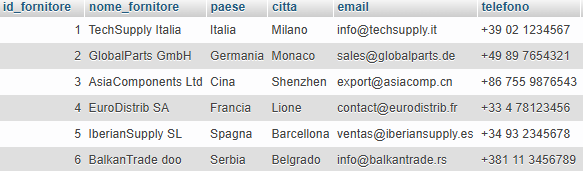
  
**Tabella categorie prodotti** contenente le categorie dei prodotti

  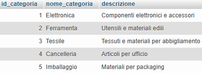
  
**Tabella magazzini** contenente le ubicazioni 

  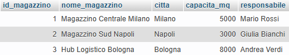
  
**Tabella prodotti** contenente il catalogo prodotti con prezzi e scorte minime

  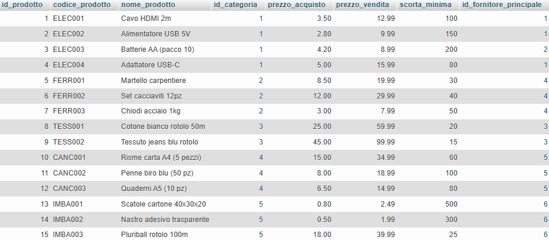
  
**Tabella inventario** contenente giacenze per prodotto/magazzino

  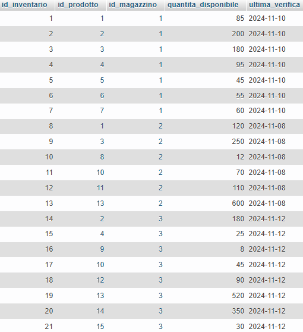
  
**Tabella ordini rifornimento** contenente gli ordini ai fornitori con date e stati

  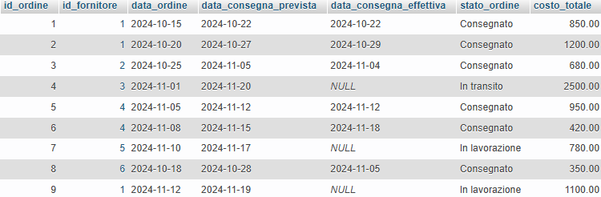
  
**Tabella dettagli ordini rifornimento** contenente il dettaglio dei prodotti ordinati in ogni rifornimento

  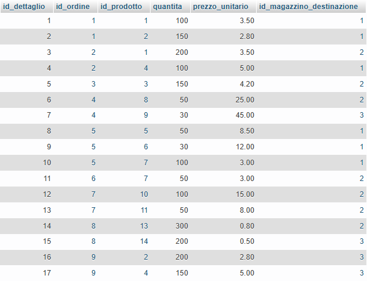
  
**Tabella movimenti magazzino** contenente lo storico entrate/uscite prodotti

  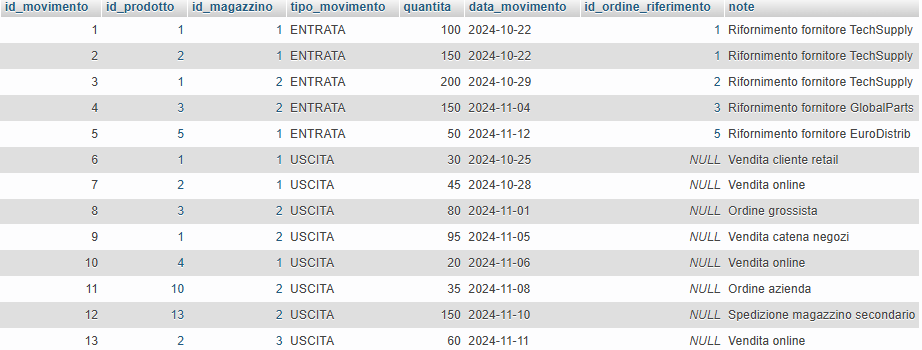

## Tecnologie Utilizzate
**Database:** MySQL, **Tool:** MAMP, phpMyAdmin, **Linguaggio:** SQL

## File del Progetto
- `database_setup.sql` script di creazione database e inserimento dati
- `query_1_sotto_scorta.sql` riordini urgenti
- `query_2_fornitori_affidabili.sql` puntualità fornitori
- `query_3_valore_inventario.sql` calcolo valore per magazzino
- `query_4_movimenti_lenti.sql` prodotti con bassa rotazione
- `README.md` documentazione progetto

## Come Utilizzare
1. Importare `database_setup.sql` in MySQL/phpMyAdmin
2. Eseguire le query nella cartella `queries/`
3. Analizzare risultati

## Query Implementate

### 1. Prodotti sotto scorta minima
**Obiettivo:** identificare riordini urgenti
Serviranno: anagrafica del prodotto (codice, nome, fornitore) e la sua scorta minima, quantità attuale e quanto manca per raggiungere la scorta minima, magazzino in cui si trova.
Utilizzerò: JOIN multiple, calcoli aritmetici (differenza scorta), WHERE/filtri sui valori calcolati, ORDER BY per priorità (maggiore deficit)

**Risultato:** 6 prodotti sotto scorta identificati

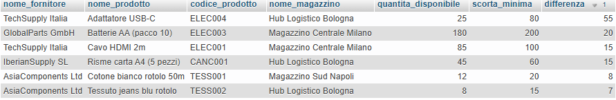

---

### 2. Fornitori più affidabili (analisi puntualità)
**Obiettivo:** identificare fornitori puntuali/ritardatari
Serviranno: anagrafica del fornitore (nome, paese, affidabilità), numero totale degli ordini fatti al fornitore, numero degli ordini consegnati in ritardo, percentuale puntualità (ordini in tempo / totale ordini)
Utilizzerò: CASE WHEN per conteggi condizionali, calcoli percentuali, SUM con condizioni, aggregazioni, GROUP BY su fornitori, confronto date (ritardi vs puntuali)

**Risultato:** top fornitore tedesco con 100% puntualità, a seguire fornitori italiani e francesi con 50% di puntualità, ultimo fornitore serbo con 1 ordine e 1 ritardo

---

### 3. Valore totale per magazzino
**Obiettivo:** calcolo del valore immobilizzato in inventario
Serviranno: anagrafica magazzino (nome, città), numero di prodotti diversi stoccati, quantità totale articoli, valore totale al prezzo di acquisto (quantità × prezzo_acquisto), valore totale al prezzo di vendita (quantità × prezzo_vendita)
Utilizzerò: calcoli su due prezzi (acquisto e vendita), SUM su moltiplicazioni (quantità × prezzo), COUNT DISTINCT per varietà prodotti, GROUP BY su magazzini, JOIN multipli per dati completi

**Risultato:** Bologna ha il valore più alto, seguita da Milano e Napoli

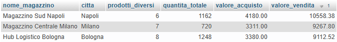

---

### 4. Prodotti fermi da tempo in magazzino
**Obiettivo:** identificare prodotti obsoleti o invenduti
Serviranno: anagrafica prodotto (codice, nome, categoria), quantità disponibile totale (somma di tutti i magazzini), data ultimo movimento, giorni senza movimenti.
Utilizzerò: LEFT JOIN per includere prodotti senza movimenti, MAX() su date per trovare ultimo movimento, DATEDIFF per calcoli temporali, HAVING per filtri su aggregazioni, gestione valori NULL (prodotti mai movimentati), GROUP BY complesso, ORDER BY dal prodotto meno movimentato

**Risultato:** 7 prodotti fermi da oltre 30 giorni, 8 prodotti senza movimenti

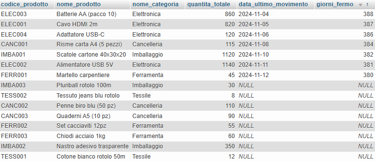

---

## Note
Progetto realizzato come portfolio per dimostrare competenze SQL e capacità di analisi dati.
I dati utilizzati all'interno delle tabelle (come nomi di società, mail, ordini effettuati, ecc) sono fittizi, generati tramite AI per rappresentare scenari business realistici. 

Le query che ho creato le ho ottimizzate per leggibilità e manutenibilità.
